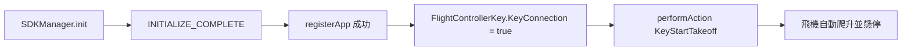

# 遞交文件：DJI Mini 4 Pro「一鍵起飛並懸停」最小 App

對象：接手這個資料夾的工程師。
目標：在 `~/git/drone-agnet-android-lite`，用一顆按鈕讓 Mini 4 Pro 自動起飛、爬升到約
1.2 m 後原地懸停；再一顆按鈕自動降落。

這個資料夾**已經寫好並且已經編譯成功**（證據見 §8）。你要做的是：確認前置條件 → 裝到
手機 → 在安全場地按下按鈕。

---

## 1. 十分鐘路徑（三個指令）

```bash
cd ~/git/drone-agnet-android-lite

# 1) 編譯（首次約 1~2 分鐘；必須用 JDK 17，見 §3）
JAVA_HOME=$(/usr/libexec/java_home -v 17) ./gradlew :app:assembleDebug

# 2) 安裝到手機（手機需開啟 USB 除錯並已授權這台電腦）
adb install -r app/build/outputs/apk/debug/app-debug.apk

# 3) 啟動並看日誌
adb shell am start -n com.durendal.droneagent.app/com.durendal.droneagent.lite.MainActivity
adb logcat -s LiteMainActivity:V LiteApplication:V
```

畫面上會看到三行狀態與兩顆按鈕：

```
registered=true            ← app key 註冊成功（需要手機有網路）
aircraft=connected         ← 飛機（不是只有遙控器）已連線
flying=false
```

`registered` 與 `aircraft` 同時成立時，「起飛並停留」按鈕才會亮。

---

## 2. 硬體前置條件（不符就一定做不到，別浪費時間 debug 程式）

| 項目 | 要求 | 原因 |
|---|---|---|
| 遙控器 | **RC-N3**（要插手機的那種） | MSDK app 跑在手機上，靠 USB accessory(AOA) 經遙控器連飛機。RC 2 是自帶螢幕的一體機，跑不了你自己的 app。 |
| 手機 | arm64（如 Pixel 8 Pro），Android 7.0+ | 本專案只打包 `arm64-v8a` 原生庫。 |
| 線 | 可傳資料的 USB-C 線（不是只充電的線） | AOA 需要資料通道。 |
| 網路 | 首次註冊時手機要能上網 | `registerApp()` 是線上驗證。 |
| 飛機 | Mini 4 Pro，電量足、已校正、螺旋槳狀態依 §6 決定 | 起飛前置條件不足時飛機會直接拒絕指令。 |

連線順序建議：飛機開機 → 遙控器開機 → 手機插上遙控器 → 開 App。

---

## 3. 軟體前置條件

- Android SDK：`local.properties`（gitignore，clone 後自己建）要有一行
  `sdk.dir=<你的 Android SDK 路徑>`，例如 `$HOME/Library/Android/sdk`。
- **JDK 17**。這台機器的預設 `JAVA_HOME` 是 JDK 25，Gradle 8.7 不支援，會直接失敗並只印
  出 `25.0.2`。所以指令一定要帶 `JAVA_HOME=$(/usr/libexec/java_home -v 17)`。
- DJI app key：放在根目錄 `dji-app-key.properties`（已 gitignore，內容不要外流）：

  ```properties
  DJI_API_KEY=<your-dji-app-key>
  ```

  **app key 綁定 package name。** 本專案的 `applicationId` 故意設成
  `com.durendal.droneagent.app`，才能沿用主專案 drone-agent-android 已申請的 key。
  想改 package，就必須到 DJI Developer Center 另開一支 app 拿新 key，否則註冊會回
  invalid app key。

  副作用：這支 APK 與主專案同 package，`adb install -r` 會**取代手機上的主 App**。
  要恢復主 App：

  ```bash
  cd ~/git/drone-agent-android && ./scripts/install-dji-debug.sh
  ```

---

## 4. 為什麼只需要一顆按鈕

`FlightControllerKey.KeyStartTakeoff` 是**飛機自己的自動起飛**：收到後啟動馬達、爬升到
約 1.2 m、然後自動懸停。不需要 virtual stick、不需要送搖桿值、不需要自己寫控制迴圈。

所以整個 App 只有四個步驟，每一步都是下一步的前提：



降落是**兩段**：`KeyStartAutoLanding` 只開始下降，低空降落保護會停住並要求
`KeyConfirmLanding`（透過 `KeyIsLandingConfirmationNeeded` 通知）。App 自動確認，
否則飛機會停在低空懸停，而降落指令看起來卻是「已被接受」。

虛擬搖桿是另一條路徑：`VirtualStickManager` enable → advanced mode → 以 20 Hz
持續送 `sendVirtualStickAdvancedParam`，見 `VirtualStickSession.kt`。

---

## 5. 檔案結構與每個「奇怪設定」的理由

```
settings.gradle.kts                  google() + mavenCentral()（MSDK 在 Maven Central）
build.gradle.kts                     AGP 8.5.2 / Kotlin 1.9.24
gradle.properties                    jetifier / nonTransitiveRClass=false（見下）
dji-app-key.properties               祕密，gitignore
app/build.gradle.kts                 依賴與打包設定（見下）
app/src/main/AndroidManifest.xml     API_KEY meta-data、USB accessory filter
app/src/main/kotlin/.../LiteApplication.kt   安裝 MSDK class loader
app/src/main/kotlin/.../MainActivity.kt      註冊 → 監聽連線 → 起飛/降落/自動確認降落
app/src/main/kotlin/.../VirtualStickSession.kt  虛擬搖桿生命週期與 20 Hz 送幀
```

這些設定不是裝飾，少一個就會壞：

| 設定 | 少了會怎樣 |
|---|---|
| `LiteApplication.attachBaseContext` 內 `com.cySdkyc.clx.Helper.install(this)` | MSDK 是混淆封裝的，class loader 沒安裝，第一次碰 SDK 類別就崩。必須在 `attachBaseContext`，比任何 SDK 呼叫都早。 |
| `implementation("com.dji:dji-sdk-v5-aircraft")` | 真正的實作。 |
| `compileOnly("...-aircraft-provided")` | 只有 API stub。若寫成 `implementation`，執行期類別被 stub 蓋掉，註冊直接失敗。 |
| `runtimeOnly("...-networkImp")` | 註冊要走網路實作，缺了就註冊不成功。 |
| `implementation("androidx.core:core:1.13.1")` | MSDK 的 analytics 在 `SDKManager.init` 內呼叫 `androidx.core.app.ActivityCompat`，但 aar 自己沒宣告這個依賴。缺了會在啟動時 `NoClassDefFoundError` 直接崩，連 `INITIALIZE_COMPLETE` 都到不了。 |
| `android.enableJetifier=true` + `android.nonTransitiveRClass=false` | MSDK 5.18.0 仍帶舊式與 transitive 資源，關掉會在資源合併／R class 階段編譯失敗。 |
| `ndk { abiFilters += "arm64-v8a" }` | 不限 ABI 會多打包無用原生庫；本 SDK 也只支援 arm64 飛控路徑。 |
| `useLegacyPackaging = true` + `extractNativeLibs="true"` | MSDK 用 `System.loadLibrary` 從解壓後的路徑載入 `.so`。 |
| `-Xskip-metadata-version-check` | MSDK 內含比本專案編譯器更新的 Kotlin metadata。 |
| manifest `com.dji.sdk.API_KEY` meta-data | MSDK **只**從這裡讀 app key，程式碼裡不放 key。 |
| `@xml/accessory_filter` | 讓 Android 在遙控器插上時把 accessory 交給這支 App；這個資源來自 MSDK aar，不用自己寫。 |

`MainActivity` 兩個容易踩的細節：

1. 監聽的是 **`FlightControllerKey.KeyConnection`**，不是 `ProductKey.KeyConnection`。
   後者只要遙控器連上就是 true，此時送起飛會被拒絕。
2. Key 監聽的 callback **不在 main thread**，所以 UI 更新全部走 `runOnUiThread`
   （集中在 `render()`）；`onDestroy` 一定要 `cancelListen(this)`。

---

## 6. 起飛前檢查清單（照做，順序不要換）

**先做無槳測試**（螺旋槳全部拆掉，飛機放桌上）：

1. 接好 → 開 App → 確認 `registered=true`、`aircraft=connected`。
2. 按「起飛並停留」。預期看到「起飛 指令已被飛機接受」或一個明確的拒絕原因。
   這一步只驗證軟體鏈路，馬達不會有推力。

**確認鏈路通了之後，才裝槳做真飛**：

1. 室外開闊處，離人與障礙物 ≥ 5 m，非禁飛區，風小。
2. 電量 > 50%；GPS 收星足夠；指南針／IMU 無警告。
3. 遙控器開機且在手邊，模式為正常飛行模式（不是運動模式限制狀態）。
4. **手指放在遙控器上**：任何異常一律用遙控器接手（拉桿即接管／按降落）。App 的
   「降落」按鈕是輔助，不是唯一救命手段。
5. 按「起飛並停留」→ 飛機爬升到約 1.2 m 懸停 → 觀察 `flying=true`。
6. 按「降落」或用遙控器降落。

---

## 7. 常見失敗與判讀

| 畫面／日誌 | 原因與處置 |
|---|---|
| Gradle 只印 `25.0.2` 就 FAILED | JDK 版本錯，改用 `JAVA_HOME=$(/usr/libexec/java_home -v 17)`。 |
| `registered=false`，訊息「註冊失敗：…invalid app key」 | key 與 `applicationId` 不匹配，或 key 打錯。見 §3。 |
| 註冊卡住不動 | 手機沒網路，或 `networkImp` 依賴被拿掉。 |
| `aircraft=disconnected`（但遙控器已插） | 飛機沒開機／未與遙控器對頻；或線只能充電；或 App 沒拿到 USB accessory 權限（拔插一次，選「允許」）。 |
| 「起飛 被拒絕：…」 | 這是**正常的前置條件不足**回報：電量低、GPS 不足、IMU/指南針未校正、已在空中、遙控器模式不允許。訊息是 MSDK 原文，照著排除。 |
| 啟動即崩，log 有 `DJI runtime loader is unavailable` | `Helper.install` 沒生效，檢查 `LiteApplication` 是否掛在 manifest 的 `android:name`。 |
| 啟動即崩，log 有 `NoClassDefFoundError: androidx/core/app/ActivityCompat` | 少了 `androidx.core:core` 依賴（見 §5）。 |
| 「降落 指令已被飛機接受」但飛機停在低空不觸地 | 低空降落保護在等 `KeyConfirmLanding`。App 會自動確認並重試 8 次；畫面出現 `landingConfirmNeeded=true` 卻一直重試被拒時，用遙控器降落並保留原文錯誤。 |
| 按「前」飛機往側面走 | MSDK `pitch`／`roll` 的欄位名與 body 軸相反（見 §8 實測）。正確映射是 `roll=forward`、`pitch=right`。 |
| 按住方向鍵沒反應、`authority=RC` | 虛擬搖桿沒真的取得控制權，或遙控器剛接管過。先關再開虛擬搖桿。 |
| 手機插電腦時 `adb devices` 空的，但 `ioreg` 看得到 Pixel | 手機 USB function 卡在 `ACCESSORY`（剛接過遙控器）。通知列 USB 改「檔案傳輸」或重開 USB 偵錯。 |

---

## 8. 本次遞交的驗證狀態（依 repo 規範，不誇大）

- **最高已驗證狀態：`HARDWARE_VERIFIED`（起飛、降落、虛擬搖桿都在 Mini 4 Pro 上飛過）**
- 原始碼證據：本資料夾所有檔案，API 用法對齊主專案
  `adapter-dji`（`DjiRegistrar`、`DjiTakeoffActionPort`、`DjiConnectionController`）
  的既有實作。
- 建置證據：`JAVA_HOME=17 ./gradlew :app:assembleDebug` → `BUILD SUCCESSFUL`，exit code 0。
- 產物證據：`app/build/outputs/apk/debug/app-debug.apk`
  - sha256 `5d7bedc0f8b0fce01505e4b73278c7e0dea87824e526a15b1811e9a44bda599d`
  - `package: name='com.durendal.droneagent.app' versionName='0.1.0-lite'`
  - `launchable-activity: com.durendal.droneagent.lite.MainActivity`
  - manifest 內 `com.dji.sdk.API_KEY` meta-data 已注入非空值
  - `classes3.dex` 含 `LiteMainActivity`、`KeyStartTakeoff`、`KeyStartAutoLanding`
  - 已打包 `lib/arm64-v8a/libdjisdk_jni.so` 等 MSDK 原生庫
- 部署證據（`DEPLOYED`）：`adb install -r` 到 Pixel 8 Pro（husky）→
  `Success`，`dumpsys package` 顯示 `versionName=0.1.0-lite`。
- 執行期證據（`RUNTIME_VERIFIED`，2026-08-14 於 Pixel 8 Pro）：
  - `LiteApplication: DJI runtime loader installed`
  - `LiteMainActivity: init event=START_TO_INITIALIZE` → `init event=INITIALIZE_COMPLETE total=100`
  - 畫面：`registered=true` / `aircraft=disconnected` / `flying=false`，訊息「app key 註冊成功，等待飛機連線…」
  - 修正記錄：初版在 `SDKManager.init` 就 `NoClassDefFoundError:
    androidx/core/app/ActivityCompat` 崩掉（`ARTIFACT_VERIFIED` 抓不到的執行期缺陷），
    補 `androidx.core:core:1.13.1` 後解決。
- 硬體證據（`HARDWARE_VERIFIED`，2026-08-14，Mini 4 Pro + RC-N3 + Pixel 8 Pro）：
  - USB accessory：`current_functions=ACCESSORY`、`current_accessory={manufacturer=DJI,
    model=com.dji.logiclink}`、`accessory_permissions={DJI RC-N2/3, uids=10323}`
    （10323 = `com.durendal.droneagent.app`）。
  - 起飛：`LiteMainActivity: 起飛 accepted`，飛機自動爬升並懸停。
  - 降落缺陷：`降落 accepted` 連續 11 次全部成功，飛機卻不觸地。根因是低空降落保護在等
    `KeyConfirmLanding`；補上自動確認後解決。**「action accepted」不等於「飛機做到」。**
  - 虛擬搖桿：enable 成功、`authority` 轉 `MSDK`、按住方向鍵飛機真的移動。
  - 軸向缺陷：MSDK 的 `pitch` 實測是 body Y 軸（左右），`roll` 是 body X 軸（前後），
    與欄位名字相反，也與主專案 `DjiBodyVelocityMapping`（`pitch=forward`、`roll=right`）
    相反。第一次飛「前進」時飛機往側面走，已改為 `roll=forward` / `pitch=right`。
    主專案那份映射從未飛過，若要沿用請先照這裡的實測修正。
- **尚未驗證**：軸向互換後的版本（sha256 `04f9…46df`）已安裝但還沒飛；`KeyStopAutoLanding`
  取消降落、RC 接管後重新取得控制權、以及低空保護「拒絕確認」的分支都沒觀察過。

---

## 9. 這支 App 刻意不做的事

- 沒有影像預覽、沒有 RTMP、沒有遙測記錄、沒有 gateway 連線。要那些請回主專案
  `drone-agent-android`。
- 沒有任何起飛准入閘（主專案的 `REAL_AIRBORNE_ACTUATION_APPROVED` 等 flag 這裡不存在）。
  它按下去就真的會送指令給飛機。**所以它只能當學習與最小驗證用，不要拿去做正式飛行
  作業，也不要把它的按鈕當成安全機制。**
- 沒有測試。它的驗收方式是 §6 的真機觀察。
